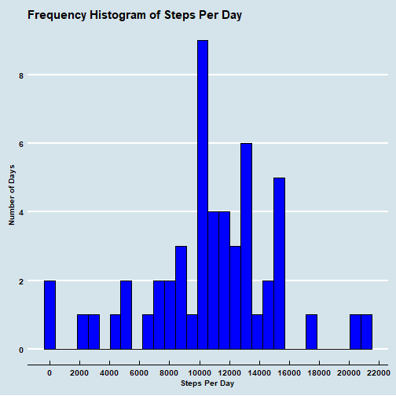
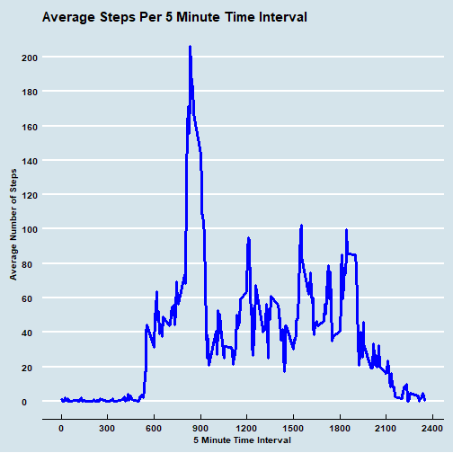
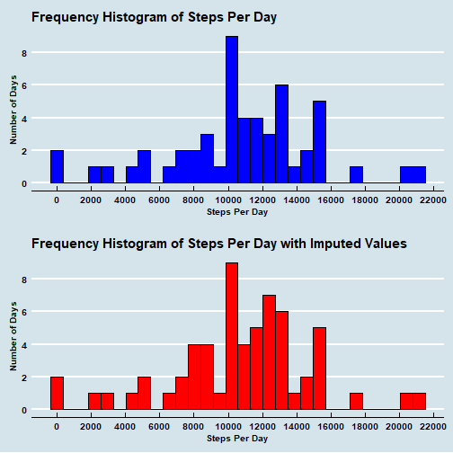
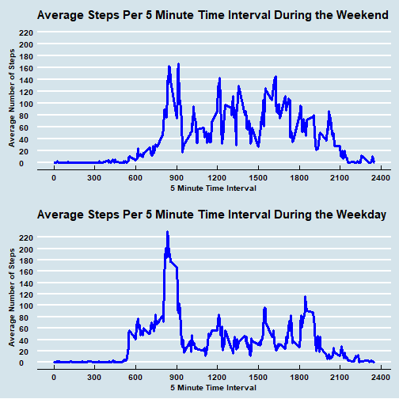

## Project Overview

Personal fitness monitors such as Fitbit, Nike Fuelband, and others, allow individuals to measure and record a wide range of body movements.  They are so popular that they have inspired their own movement--the "qunatified self" movement--consisting of individuals who take measurements of themselves and analyze those measurements to find patterns in their behavior that might impact their health or simply out of curiousity about their lifestyles.  This project is one of those curiousities.

The activity.zip dataset for this project forms the basis for a series of inquires set forth below about activity levels in the form of steps taken during the day.  The data was drawn from a personal activity monitoring device worn by a single test subject that collected data about the number of steps taken at 5 minute intervals throughout the day for a two month period from October 1, 2012 through November 30, 2012.  The analysis below addresses several aspects of this data.

## Project Software

This project was performed using the following software:

*  Rx64 3.4.2 running on x86_64-w64-mingw32/x64 (64-bit) Windows 10 system.  

*  RStudio Version 1.1.383.  RStudio is highly recommended to view this .Rmd file because of its built-in knitr functionality.  

The following R packages and their dependencies are also required to view this file:  

*  rio v. 0.5.5 

*  dplyr v. 0.7.4 

*  lubridate v.1.7.0 

*  ggplot v. 2_2.2.1 

*  ggthemes v. 3.4.0  

The packages must be downloaded into the current R session environment and can be called into R using the following script:


```r
## Load required R packages
library(rio)
library(lubridate)
library(dplyr)
library(ggplot2)
library(ggthemes)
```

Masking messages from the installation of these packages can be ignored for purposes of viewing this project description. 

This analysis also requires the download of the multiplot.R file located in this repo in to the current working directory.  This file can then be made available in R using:


```r
source("multiplot.R")
```

multiplot.R is designed to allow for the grid presentation of multiple ggplot2 plots in one graphics frame.  Examples are found below.  More detailed information on the use of multiplot is found in detailed comments in the code file.

##Project Data

###Loading the Project Dataset

The following R code will download the data file for this project into the current working directory.  It first checks to ensure that the file is not already present.  A copy of this file is also included in this repo.


```r
## Download Data Source File
if (!file.exists("activity.zip")) {
    
    download.file("https://d396qusza40orc.cloudfront.net/repdata%2Fdata%2Factivity.zip",
                  "activity.zip", mode = "wb")
}
```

The data is then imported into the current R session by rio:


```r
source_dataset <- import("activity.zip")
```

###Inspecting the Project Dataset

Summary information for the project dataset is as follows:


```r
str(source_dataset)
```

```
## 'data.frame':	17568 obs. of  3 variables:
##  $ steps   : int  NA NA NA NA NA NA NA NA NA NA ...
##  $ date    : chr  "2012-10-01" "2012-10-01" "2012-10-01" "2012-10-01" ...
##  $ interval: int  0 5 10 15 20 25 30 35 40 45 ...
```

From this summary, we can see that the dataset is an R data frame with 17,568 records, each containing three variables.  The record count matches exactly the number of observations specified by the data source.

We can also confirm the following three variables:

*  **steps.**    Datatype: int.  The number of steps taken during the 5 minute time interval.  Missing values are coded as NA.

*  **date.**     Datatype: chr.  The date on which the measurement was taken in YYYY-MM-DD format.  This date is repeated for each 5 minute interval associated with the date.

*  **interval.** Datatype: int. An integer representation of each 5 minute interval in each day.

There are several additional issues in this dataset that merit further analysis.

####Number of Days.

We know that October 2012 had 31 days and that November 2012 has 30 days.  To be complete the dataset should contain 61 days.  To confirm this, we examined the dataset to count the number of unique dates:


```r
unique_dates <- with(source_dataset, unique(source_dataset$date,incomparables = FALSE))
summary(unique_dates) 
```

```
##    Length     Class      Mode 
##        61 character character
```
The summary of this analysis confirms the existance of 61 dates in the dataset.

####Number of Observations Per Day

We also know that there are 1440 minutes per day, assuming a 24 hour period (24 hours/day * 60 min/hour = 1,440 minutes/day).  We also know that the data was collected at 5 minute intervals, meaning that there should be 288 observations for each day (1,440 min/day / 5 minute = 288 records).  Finally, we know that there are 17,568 observations in the dataset.  17,568 observations / 288 observations per day = 61 days, which is consistent with our findings above. We will see additional proof that there are 288 observations in our analysis, below.

####NA Values

The following summary provides us with information regarding missing values in the dataset: 


```r
summary(source_dataset)
```

```
##      steps            date              interval     
##  Min.   :  0.00   Length:17568       Min.   :   0.0  
##  1st Qu.:  0.00   Class :character   1st Qu.: 588.8  
##  Median :  0.00   Mode  :character   Median :1177.5  
##  Mean   : 37.38                      Mean   :1177.5  
##  3rd Qu.: 12.00                      3rd Qu.:1766.2  
##  Max.   :806.00                      Max.   :2355.0  
##  NA's   :2304
```

There are no missing date or interval values, but there are 2,304 missing steps values coded as NA, representing 13.1147541% of the observations.

Further, the NA values display an interesting pattern:


```r
## NA Pattern: Filter out NA records 
source_NA_records <- source_dataset %>% filter(is.na(source_dataset$steps))

## Combine NA records by date
NA_records_by_date <- aggregate(cbind(records = steps) ~ date,
                                data = source_NA_records,
                                FUN = function(x){NROW(x)},
                                na.action = NULL) 

## Add information about number of hours
NA_records_by_date <-  NA_records_by_date %>%
                       mutate(hours = NA_records_by_date$records / 12)

print(NA_records_by_date)
```

```
##         date records hours
## 1 2012-10-01     288    24
## 2 2012-10-08     288    24
## 3 2012-11-01     288    24
## 4 2012-11-04     288    24
## 5 2012-11-09     288    24
## 6 2012-11-10     288    24
## 7 2012-11-14     288    24
## 8 2012-11-30     288    24
```

All of the missing values occur in 8 days and represent all 288 5 minute invervals (all 24 hours) for those days.  We have no information about the setup or conduct of the experiment to know what exactly occurred on those dates.  We can, however, use this information to our advantage when we attempt to impute values in our later analysis.

###Tidying Up the Dataset

The data is organized in an ordered time sequence commencing at midnight on October 1, 2012 and running every 5 mintues through November 30, 2012, so no ordering is necessary.  However, we thought it would be useful at the onset to add datetime information.  This required that we decompose the interval into hour and minute components and recombine into a datetime object:


```r
## Assumes start at midnight on first day.  
## Convert date and time into a POSIXct value for analysis
## Remove extra columns
dataset <- with(source_dataset,
                source_dataset %>%
                select(steps, date, interval) %>%
                mutate(hours = trunc(interval / 100)) %>%
                mutate(minutes = ceiling(100 * (source_dataset$interval / 100 - hours))) %>%
                mutate(combined = paste(date, " ", hours, ":", minutes, sep = "")) %>%
                mutate(datetime = ymd_hm(combined)) %>%
                mutate(day = wday(datetime, label = TRUE)))

dataset <- with(dataset,
                select(dataset, steps, date, interval, day, datetime))   
str(dataset)
```

```
## 'data.frame':	17568 obs. of  5 variables:
##  $ steps   : int  NA NA NA NA NA NA NA NA NA NA ...
##  $ date    : chr  "2012-10-01" "2012-10-01" "2012-10-01" "2012-10-01" ...
##  $ interval: int  0 5 10 15 20 25 30 35 40 45 ...
##  $ day     : Ord.factor w/ 7 levels "Sun"<"Mon"<"Tue"<..: 2 2 2 2 2 2 2 2 2 2 ...
##  $ datetime: POSIXct, format: "2012-10-01 00:00:00" "2012-10-01 00:05:00" ...
```

The new variables are the day of the week and the datetime object.

This is the dataset we will use in the following inquires.

##Inquiry 1: What is the mean total number of steps taken per day?

Answering this inquiry requires further modification of the dataset in order to plot the total number of steps taken each day.  Specifically, the following code aggregates the number of steps for each day and then creates a histogram of the number of steps taken each day.


```r
## Calculate total number of steps per day
plotdata1 <- with(dataset,                                 
                  aggregate(steps, by = list(date), 
                            sum, na.action = NULL))
names(plotdata1) <- gsub("Group.1", "Day", names(plotdata1))           
names(plotdata1) <- gsub("x", "Steps", names(plotdata1)) 

## Create histogram
plot1 <- ggplot(plotdata1, aes(x = Steps)) +
         geom_histogram(aes(y = ..count..),
                        color = "black",
                        fill  = "blue") +
         scale_x_continuous(name   = "Steps Per Day",
                            breaks = seq(0, 26000, 2000)) +
         scale_y_continuous(name   = "Number of Days",
                            breaks = seq(0, 10,2))        +
         ggtitle("Frequency Histogram of Steps Per Day")  +
         theme_economist()                                +
         theme(axis.text.x  = element_text(face = "bold"),
               axis.title.x = element_text(face = "bold"),
               axis.text.y  = element_text(face = "bold"),
               axis.title.y = element_text(face = "bold")) 

print(plot1)
```



The mean and median steps per day are summarized here:


```r
summary(plotdata1$Steps)
```

```
##    Min. 1st Qu.  Median    Mean 3rd Qu.    Max.    NA's 
##      41    8841   10765   10766   13294   21194       8
```
The mean number of steps per day is 10766.1887.
The median number of steps per day is 10765. 

##Inquiry 2: What is the average daily activity pattern?

Our inquiry into the average daily activity pattern looks at the average number of steps taken averaged across all days by 5 minute intervals.  To accomplish this, the dataset is once again modified to calculate the average number of steps and then plotted.


```r
## Filter out NA values and calculate average steps per interval
plotdata2 <- with(dataset,
                  dataset %>%
                  group_by(interval) %>%
                  filter(!is.na(steps)) %>%
                  summarize(average.steps = mean(steps, na.rm = TRUE)))
names(plotdata2) <- gsub("Group.1", "Interval", names(plotdata2))           
names(plotdata2) <- gsub("x", "Steps", names(plotdata2)) 

## Plot results
plot2 <- ggplot() +
         geom_line(aes(y = average.steps, x = interval),
                   size = 1.3, color = "blue",
                   data = plotdata2) +
         scale_x_continuous(name   = "5 Minute Time Interval",
                       breaks = seq(0, 2400, 300)) +
         scale_y_continuous(name   = "Average Number of Steps",
                       breaks = seq(0, 220,20))        +
         ggtitle("Average Steps Per 5 Minute Time Interval") +          
         theme_economist()                                +
         theme(axis.text.x  = element_text(face = "bold"),
               axis.title.x = element_text(face = "bold"),
               axis.text.y  = element_text(face = "bold"),
               axis.title.y = element_text(face = "bold")) 

print(plot2)
```



The 5 minute interval that contains the maximum number of steps is Interval 835 representing 206.17 average steps at 8:35AM:


```r
glimpse(plotdata2[which.max(plotdata2$average.steps), ])
```

```
## Observations: 1
## Variables: 2
## $ interval      <int> 835
## $ average.steps <dbl> 206.1698
```

##Inquiry 3: Imputing missing values

Inquiry 3 returns us to the analysis of the missing steps values.  As noted above the total number of missing values are all in the steps variable and are computed as follows:


```r
sum(is.na(dataset))
```

```
## [1] 2304
```

It is possible to devise a number of strategies to estimate the missing values and impute them into the dataset.  For this inquiry, we used an estimate of the average number of steps each weekday to replace the missing values. To accomplish this, we first compute the average number of steps by day of the week and then use these values as a lookup table to replace the missing values, creating a new dataset.  We then plot a new histogram containing the imputed values and compare it to our prior histogram.


```r
## Filter out NA observations and calculate total steps
ave_steps_day <- with(dataset,
                      dataset %>%
                          group_by(date) %>%
                          filter(!is.na(steps)) %>%
                          summarize(daily.steps = sum(steps, na.rm = TRUE)))

## Change date into date object and add the weekday
ave_steps_day <- with(ave_steps_day,
                      ave_steps_day %>%
                      mutate(date = ymd(date)) %>%
                      mutate(day = wday(date, label = TRUE)))

## Calculate average steps by day
ave_steps_day <- with(ave_steps_day,
                      ave_steps_day %>%
                      group_by(day) %>%
                      summarize(average.steps = mean(daily.steps, na.rm = TRUE)))

## Prepare the plotting dataset and add the weekday as an index to the lookup table
plotdata3 <- with(plotdata1,
                  plotdata1 %>%
                  mutate(Day = ymd(Day)) %>%
                  mutate(Weekday = wday(Day, label = TRUE)))

## ID NA values and replace with daily average
plotdata3$Steps <- ifelse(is.na(plotdata3$Steps) == TRUE,
                          ave_steps_day$average.steps[ave_steps_day$day %in%             plotdata3$Weekday],
                          plotdata3$Steps)

## Create plot
plot3 <- ggplot(plotdata3, aes(x = Steps)) +
    geom_histogram(aes(y = ..count..),
                   color = "black",
                   fill  = "red")  +
    scale_x_continuous(name   = "Steps Per Day",
                       breaks = seq(0, 26000, 2000)) +
    scale_y_continuous(name   = "Number of Days",
                       breaks = seq(0, 10,2)) +
    ggtitle("Frequency Histogram of Steps Per Day with Imputed Values")  +
    theme_economist() +
    theme(axis.text.x  = element_text(face = "bold"),
          axis.title.x = element_text(face = "bold"),
          axis.text.y  = element_text(face = "bold"),
          axis.title.y = element_text(face = "bold")) 

## Display comparative plots
multiplot(plot1, plot3, cols = 1)
```



The new dataset contains addtional step counts which are reflected in the new histogram.  As expected, the addtional steps also impact the mean and median values:


```r
summary(plotdata3$Steps)
```

```
##    Min. 1st Qu.  Median    Mean 3rd Qu.    Max. 
##      41    8841   11015   10774   12811   21194
```

The new mean number of steps per day is 10774.1701.
The new median number of steps per day is 11015.0000.
Both values are slightly higher than the original analysis in Inquiry 1.

##Inquiry 4: Are there differences in activity patterns between weekdays and weekends?

This inquiry requires that we first change strategies for imputing missing data to replace missing values by interval instead of by day. Then we classify the days by weekend and weekday and provide comparative plots for each classification.


```r
## Reimpute data by interval
## Filter out NA observations and calculate average steps per interval
ave_steps_interval <- with(dataset,
                      dataset %>%
                          group_by(interval) %>%
                          filter(!is.na(steps)) %>%
                          summarize(interval.steps = mean(steps, na.rm = TRUE)))

## Impute average interval steps into NA values in dataset
imputed_dataset <- dataset   # Preserves original dataset
imputed_dataset$steps <- ifelse(is.na(imputed_dataset$steps) == TRUE,
                          ave_steps_interval$interval.steps[ave_steps_interval$interval %in% imputed_dataset$interval],
                          imputed_dataset$steps)

## Add weekday/weekend factor variable 
imputed_dataset <- with(imputed_dataset,
                        imputed_dataset %>%
                        mutate(Class = as.factor(ifelse(day %in% c("Sat","Sun"), 
                                                        "Weekend", "Weekday")) ))

## Filter out Weekend intervals and calculate average interval steps
weekend <- with(imputed_dataset,
                imputed_dataset %>%
                    group_by(interval) %>%
                    filter(Class == "Weekend") %>%
                    summarize(interval.steps = mean(steps)))

## Create Weekend plot
weekend_plot <- ggplot() +
                geom_line(aes(y = interval.steps, x = interval),
                              size = 1.3, color = "blue",
                              data = weekend) +
                scale_x_continuous(name   = "5 Minute Time Interval",
                       breaks = seq(0, 2400, 300)) +
                scale_y_continuous(name   = "Average Number of Steps",
                       breaks = seq(0, 220,20))        +
                expand_limits(y = c(0, 220))  +
                ggtitle("Average Steps Per 5 Minute Time Interval During the Weekend") +          
                theme_economist()                                +
                theme(axis.text.x  = element_text(face = "bold"),
                      axis.title.x = element_text(face = "bold"),
                      axis.text.y  = element_text(face = "bold"),
                      axis.title.y = element_text(face = "bold")) 

## Filter out Weekday intervals and calculate average interval steps
weekday <- with(imputed_dataset,
                imputed_dataset %>%
                    group_by(interval) %>%
                    filter(Class == "Weekday") %>%
                    summarize(interval.steps = mean(steps)))

## Create Weekday plot
weekday_plot <- ggplot() +
                geom_line(aes(y = interval.steps, x = interval),
                              size = 1.3, color = "blue",
                              data = weekday) +
                scale_x_continuous(name   = "5 Minute Time Interval",
                       breaks = seq(0, 2400, 300)) +
                scale_y_continuous(name   = "Average Number of Steps",
                       breaks = seq(0, 220,20))        +
                ggtitle("Average Steps Per 5 Minute Time Interval During the Weekday") +          
                theme_economist()                                +
                theme(axis.text.x  = element_text(face = "bold"),
                      axis.title.x = element_text(face = "bold"),
                      axis.text.y  = element_text(face = "bold"),
                      axis.title.y = element_text(face = "bold")) 

## Display comparative plots
multiplot(weekend_plot, weekday_plot, cols = 1)
```



